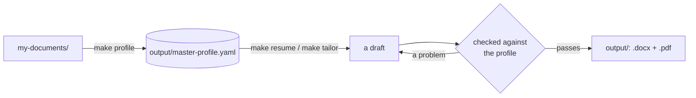

# Resume-Tailor

Turn your real career history into the documents a job search needs: a general resume, a LinkedIn
profile, and a resume and cover letter tailored to any job you point it at. Every document is read
by a recruiter *and* by the AI and applicant-tracking parsers that screen for them, so each one is
written to work for both.

> It never invents experience. Every document is drawn from one record of your real history and
> checked against it before it is written. A resume that wins an interview and then falls apart
> in the conversation helps no one.

## Where things go

You put your documents in `my-documents/`, and everything the project writes lands in `output/`:

```text
my-documents/
  career-history/        your old resumes (PDF, Word, text), a LinkedIn PDF export, brag docs, notes
  job-postings/          one .md or .txt file per job you want to apply to
output/
  master-profile.yaml    your career as structured data, built by `make profile`
  general/               `make resume`: your general resume and LinkedIn profile
  applications/          `make tailor`: a resume and cover letter for each job
  backups/               earlier versions, kept whenever something is replaced
examples/                a fictional profile and tailored application, to see what you'll get
```

Both [`my-documents/`](my-documents/) and [`output/`](output/) are gitignored, apart from the
README in each folder that says what goes in it.

## Setup

```bash
git clone <this repo> && cd Resume-Tailor
make setup                       # creates .venv and installs everything
cp .env.example .env
```

Then choose who answers the scripts, with `RESUME_TAILOR_LLM` in `.env`:

- **`anthropic`**: the scripts call the Anthropic API with your `ANTHROPIC_API_KEY`, billed per
  token. `RESUME_TAILOR_MODEL` picks the model and `RESUME_TAILOR_EFFORT` how hard it thinks;
  `.env.example` lists the options and their prices.
- **`claude-code`**: no key and no API bill. Each request is written to `.relay/` and the script
  waits while a Claude Code session in this folder answers it. Run the script, then ask Claude to
  "answer the relay". Every reply goes through the same checks an API reply does.

## How to use it

**1. Build your master profile.** Drop anything about your career into
[`my-documents/career-history/`](my-documents/career-history/): old resumes (PDF, Word `.docx` or
text), a LinkedIn export, brag docs, performance reviews. Then:

```bash
make profile
```

It drafts `output/master-profile.yaml` from everything it can read, then **refines** it: the same
accomplishment told by two documents is recorded once, each accomplishment sits under the role it
belongs to, noise is dropped, and levels and years never claim more than your documents show. The
refinement is checked mechanically, so it can merge and tidy but never add a fact or lose one.
Anything it could not settle becomes a question, asked right there; your answers go into the
profile.

It lists every file it read, and every file it could not read along with the reason. It will not
replace a profile you already have unless you say so (`make profile FORCE=--force`, which keeps a
backup in `output/backups/`). Added new documents later? Drop them in
`my-documents/career-history/` and rebuild.

**2. Your general resume and LinkedIn profile.**

```bash
make resume
```

Writes `output/general/`:

| File | What it is |
|---|---|
| `resume.docx` / `resume.pdf` | One well-rounded resume aimed at your target roles: your strongest, most distinct work, one or two pages |
| `linkedin.md` | Everything to put on LinkedIn, section by section and within LinkedIn's limits: headline, About, top skills, every position, education, certifications, skills, Open to Work titles |

**3. A resume and cover letter for one job.** Save the posting as a `.md` or `.txt` file in
[`my-documents/job-postings/`](my-documents/job-postings/) and name it:

```bash
make tailor JOB=stripe-staff-backend.md
```

A posting in `my-documents/job-postings/` needs only its file name; one saved anywhere else takes
its path. This writes `output/applications/<company>-<role>/`: `resume.docx` / `resume.pdf`
tailored to that posting, a one-page `cover-letter.docx` / `cover-letter.pdf`, and the posting
itself for reference. It also tells you how strong the match is and where the gaps are.

Running step 2 or 3 again replaces its folder, but the previous version is moved to
`output/backups/` first, so nothing you edited by hand is lost. A different posting for the same
company and role gets its own folder (`…-2`).

### The review before the final files

Steps 2 and 3 review what they wrote before any Word or PDF file exists:

1. Mechanical problems in the resume are fixed (spacing, punctuation, date ranges, a skill listed
   twice), and the run tells you what it fixed.
2. An editor pass tightens every document for readability, under the same no-invention check.
3. You get the questions only you can answer: a must-have the posting asks for that your profile
   never mentions, an accomplishment with no outcome, a missing date. At most eight, most
   important first. Answer in a sentence, press Enter to skip, type `done` (or press Ctrl-C) to
   finish.
4. Your answers go into your master profile (and a log in
   `my-documents/career-history/answers.md`), the documents are revised to use them, and *then*
   the final files are written.

Run without a terminal (in CI, or from Claude Code) and it skips the asking: the final files are
written and the open questions are printed, so you can add the facts to your profile and run it
again.

## Which file to send

`resume.docx` is the one to upload to any application portal (Workday, Greenhouse, Lever...):
Word files are the most reliably parsed format. `resume.pdf` is the same document for a form that
only takes PDF, or for an email. Both are single-column, standard headings, no tables or graphics,
contact details in the body, set in Arial. [Why that layout →](reference/RESUME-FORMATS.md)

Edited a `.md` by hand? Re-render it with
`.venv/bin/resume-tailor build output/applications/<folder>/resume.md` (or whichever file you
edited).

## In Claude Code

Open the folder and ask. *"Build my master profile"*, *"make my general resume"* and *"tailor my
resume to acme.md"* run the same scripts. With `RESUME_TAILOR_LLM=claude-code`, Claude also
answers the scripts' model requests through the relay. Claude then asks you the review's questions
in the chat, records your answers in the profile, and reruns the script so the files use them.
`/tailor` does the tailoring step directly.

## How it works



A language model writes; ordinary, fully tested code decides whether what it wrote may reach a
file. Every employer, title, date, credential, figure and listed skill in a draft is traced back
to your master profile. A draft that claims something the profile does not support goes back to
the model with the exact problem, and after three failed attempts the run stops rather than write
it. [The full architecture →](reference/ARCHITECTURE.md)

## The master profile

Your career lives in `output/master-profile.yaml` as structured data, not prose, so every
document can be drawn from it precisely and checked against it. A short excerpt from the fictional
example:

```yaml
technologies:
  - group: Cloud & Infrastructure
    items:
      - name: Kubernetes
        aliases: [K8s]                # screeners search for either spelling
        level: proficient
        years: 3
        used_at: [northwind-payments]

experience:
  - id: northwind-payments
    company: Northwind Payments
    roles:
      - title: Senior Backend Engineer
        start: 2021-03
        end: present
        highlights:
          - label: Settlement Throughput
            text: >-
              Redesigned the settlement pipeline to process 4M+ daily transactions, cutting
              end-to-end latency 38% (820ms → 510ms).
            tags: [performance, latency, scale, go]
```

`.venv/bin/resume-tailor profile validate` checks it and lists what its audit still flags;
`.venv/bin/resume-tailor profile render` writes a readable copy to `output/master-profile.md`. The
schema is generated from the code, so an editor that understands `# yaml-language-server:`
autocompletes and validates it as you type. The complete example is
[`examples/master-profile.yaml`](examples/master-profile.yaml); see
[the guide](reference/HOW-TO-BUILD-YOUR-PROFILE.md) for building your own.

## Your privacy

Your data (`my-documents/` and `output/`) is **gitignored** and never leaves your machine except
in the requests to the model. So are `.env`, which holds your API key, and `.relay/`, whose
requests carry your profile. Only the templates, examples, tooling, schema and docs are tracked.

## Developing

```bash
make check     # ruff (full rule set) + mypy --strict + pytest at 100% coverage
make format    # auto-fix and reformat
```

Source is in `src/resume_tailor/`, tests mirror it in `tests/`. CI runs the same checks.
[How it fits together →](reference/ARCHITECTURE.md)

## Learn more

- [reference/ARCHITECTURE.md](reference/ARCHITECTURE.md): how it works, package by package
- [CLAUDE.md](CLAUDE.md): the workflow and rules Claude follows in this project
- [reference/HOW-TO-BUILD-YOUR-PROFILE.md](reference/HOW-TO-BUILD-YOUR-PROFILE.md): building and keeping your profile
- [reference/RESUME-FORMATS.md](reference/RESUME-FORMATS.md): the resume layout, and why
- [reference/ATS-PLAYBOOK.md](reference/ATS-PLAYBOOK.md): how resume screeners work and how to pass them honestly
- [templates/](templates/): the resume and cover-letter formats
- [examples/](examples/): a fictional master profile and a tailored application, as worked examples
