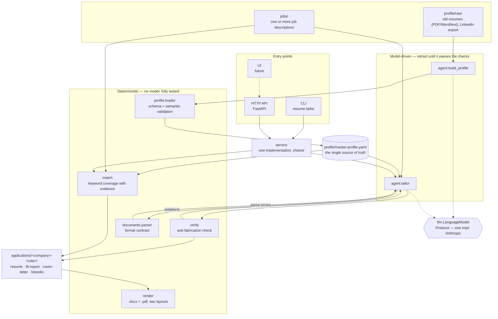

# Architecture

Resume-Tailor has two halves that never mix: **deterministic Python** that you can trust and test,
and a **language model** that writes prose. Everything the model produces is checked by the
deterministic half before it reaches a file.

## The rule that shapes everything

**The model never writes directly to a file.** `agent.tailor` asks for a resume, then:

1. `documents.parse` must accept it — the format contract in `templates/resume.md`.
2. `verify.verify_resume` must return no violations — every employer, title, date, technology and
   **metric** must trace back to the profile.

A failure sends the *specific* violations back to the model and retries. After the last attempt it
raises `FabricationError` rather than writing a resume containing an invented claim. That is why
"never fabricates" is a property of the system and not a hope about the prompt.

## Why the model sits behind a Protocol

`llm.LanguageModel` is a `Protocol` with one method. Nothing in `agent/`, `service/` or `api/`
imports the Anthropic SDK, so every test above the boundary drives a fake and stays deterministic —
which is how a package that calls an LLM still holds 100% branch coverage. A second provider is a
new file, not a refactor.

## Two ways in, one implementation

`service/` holds the orchestration. The CLI and the HTTP API are both thin adapters over it, so
they cannot drift. A UI talks to the API and gets the same behaviour the CLI has.

Tailoring is synchronous today. When a UI needs progress reporting, a job queue slots in at the
service layer without touching the agent or verification code.

## What runs without an API key

Everything except generation: profile validation, keyword coverage (`match`), and rendering to
`.docx`/`.pdf`. The `/health` and `/match` endpoints work with no key configured.
