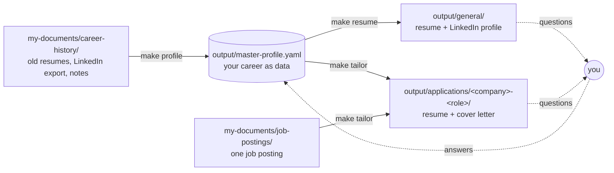
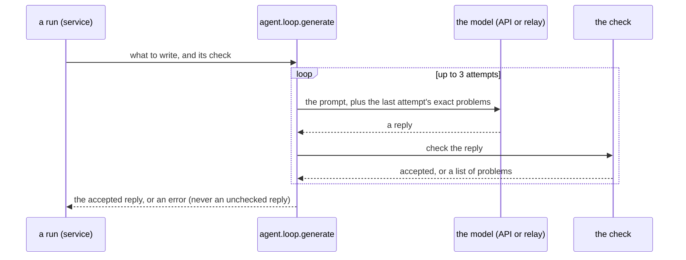
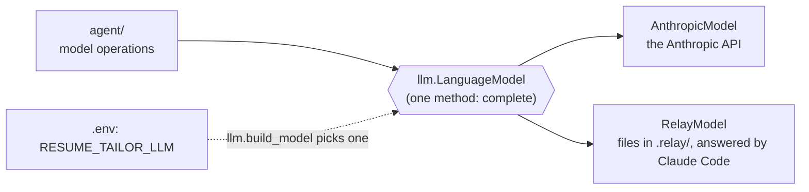
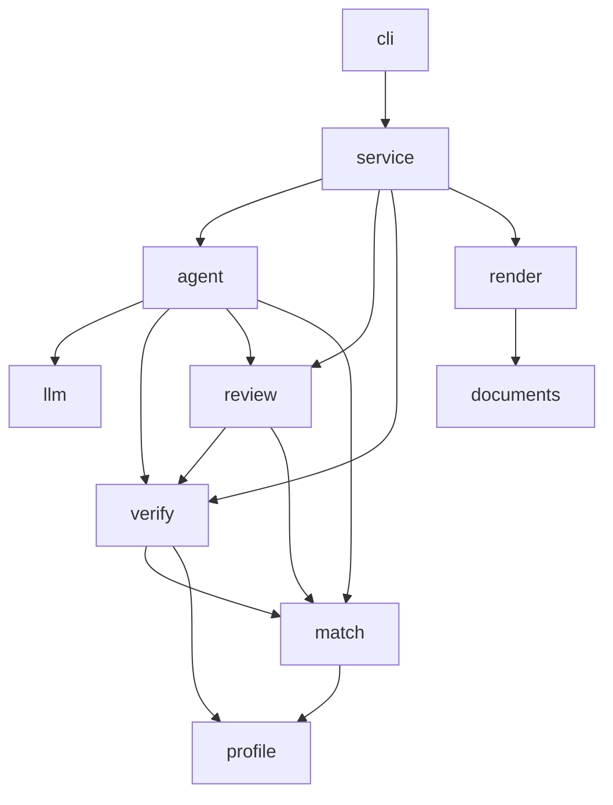

# How Resume-Tailor works

Resume-Tailor turns a record of your real career into resumes, a LinkedIn profile and cover
letters. A language model does the writing. Ordinary, fully tested Python decides whether what it
wrote may reach a file. That split is the whole design: **the model proposes, the code checks.**

## The big picture

Everything starts from one file, the **master profile**. Every document is selected and reworded
from it and checked against it, and every answer you give goes back into it, so the profile gets
better each time you use the tool.

## The three runs

| Command | Reads | Writes |
|---|---|---|
| `make profile` | every file in `my-documents/career-history/` | `output/master-profile.yaml` |
| `make resume` | the profile | `output/general/`: the resume (`.md`, `.docx`, `.pdf`) and `linkedin.md` |
| `make tailor JOB=…` | the profile and one posting | `output/applications/<company>-<role>/`: resume, cover letter, the posting |

**`make profile`** (`service/profile.py`)

1. **Read.** Extract the text of every PDF, Word, Markdown and text file (`read_raw_documents`).
2. **Draft.** The model records every career fact as YAML (`agent.build_profile`). The draft must
   load against the schema.
3. **Refine.** A second pass records each fact once, in the right place (`agent.refine_profile`).
   `verify.changes.check_refinement` rejects a refinement that adds a fact or loses one; if no
   attempt passes, the checked draft is written instead and you are told.
4. **Settle.** An audit (`review.review_profile`) lists what still needs a look, and every open
   note becomes a question. Your answers are recorded in the profile.

**`make resume` and `make tailor`** (`service/applications.py`)

1. **Match** (tailor only). `match.match_posting` compares the posting with your profile, with no
   model involved, and gives the writer a keyword analysis: what you can claim, what to qualify,
   and the gaps.
2. **Write.** The model drafts the documents (`agent.write_general` or `agent.tailor`).
3. **Review.** Mechanical fixes to the resume (`review.apply_fixes`), then an editor pass over
   every document (`agent.edit_documents`) held to the same checks as the draft.
4. **Ask.** The questions only you can answer, at most eight, most important first. At a terminal
   they are asked as the run goes; otherwise they are printed at the end.
5. **Record and revise.** Answers are logged to `my-documents/career-history/answers.md`, recorded
   in the profile, and the documents are revised to use them.
6. **Export.** `render.build` writes the Word and PDF files. The run builds into a hidden folder
   and swaps it in at the end, so a failure never leaves a half-written folder behind, and the
   folder it replaces moves into `output/backups/`.

## The safety loop

The model never writes a file directly. Every model operation goes through one retry loop,
`agent.loop.generate`, together with a check its reply must pass:

| Operation | Its reply must pass |
|---|---|
| `build_profile` (draft) | the profile loader (schema and field rules) |
| `refine_profile` | the loader, and `check_refinement`: nothing added, nothing lost, no level raised |
| `update_profile` (your answers) | the loader, and `check_update`: every new fact, figure, technology and contact detail appears in your answers |
| `write_general`, `tailor`, `edit_documents` | each document's format (LinkedIn's limits, one page for a letter), and `verify_resume` on every document |

`verify_resume` is the anti-fabrication check. It traces what a document claims back to the
profile:

- **Employers, titles and dates** (`verify/history.py`): every role on the page is one you held,
  over dates no wider than the profile records; degrees and certifications are the ones you have.
- **Figures** (`verify/metrics.py`, `verify/numbers.py`): every number is one the profile
  states, whether it is written in digits or in words ("nine", "a dozen", "halved"), and a size
  in words ("thousands of users") never claims more than the profile's own figures. A
  technology's years of use back only a duration ("8 years of Python"), never a headcount.
- **Skills** (`verify/skills.py`): every item in a Skills line (labelled or not) or a Tech Stack
  note is a technology the profile records, under its name or an alias.

A reply that fails gets the specific problems back and tries again. After the last attempt the run
stops with an error rather than writing an unchecked document. That is why "never fabricates" is a
property of the code, not just an instruction in a prompt.

## Where the model plugs in

- **`anthropic`**: `AnthropicModel` calls the Anthropic Messages API with `ANTHROPIC_API_KEY`.
- **`claude-code`**: `RelayModel` writes each request to `.relay/<id>.request.md` and waits for a
  Claude Code session to answer it: the reply is written to `<id>.response.md.tmp` and moved onto
  `<id>.response.md`, so it is never read half-written (or the reason goes in `<id>.error.md` to
  decline). Answered requests move to `.relay/answered/`. A relay reply goes through exactly the
  same checks as an API reply.

Nothing outside `llm/` imports the Anthropic SDK, so the rest of the package is tested against a
fake model and stays deterministic.

## Package map

| Package | What it does | Start reading at |
|---|---|---|
| `cli.py` | Commands, arguments and everything printed to the terminal | `main` |
| `service/` | The three runs, end to end | `build_master_profile`, `general_application`, `tailor_application` |
| `agent/` | Every model operation, its prompt and its check, and the retry loop | `loop.generate`, `writing.py`, `profiling.py`, `prompts.py` |
| `llm/` | The model boundary: API client, relay, settings from `.env` | `build_model`, `load_settings` |
| `verify/` | The anti-fabrication checks | `verify_resume`, `check_refinement`, `check_update` |
| `review/` | Mechanical review, LinkedIn limits, the profile audit, the questions | `review_resume`, `check_linkedin`, `review_profile`, `gather` |
| `match/` | Posting-to-profile keyword matching, no model | `match_posting` |
| `profile/` | Profile models, loader, JSON Schema, readable view | `load`, `build_schema`, `render_markdown` |
| `documents/` | Parses resume and letter Markdown into typed blocks | `parse` |
| `render/` | Word and PDF output, single-column and two-column layouts | `build` |
| `paths.py` | Where every input and output lives | |
| `errors.py` | The errors a user can see | |

The arrows only point one way: lower layers never import the runs or the CLI.

## Testing

`make check` runs ruff with every rule enabled, mypy in strict mode, and pytest with 100% branch
coverage; CI runs the same. Tests drive a fake model at the `LanguageModel` boundary, exercise the
relay with real files in temporary folders, and stub the browser that prints PDFs; wherever Chrome
(or another Chromium browser) is installed, a few more tests print real PDFs and check that their
text reads in order. The checks in `verify/` are tested in both directions: each fabrication they
must catch, and the true content written the way resumes really write it that they must let
through. The shipped examples and templates are held to the same checks as a generated document
(`tests/test_examples.py`).

## Known limits

The checks are mechanical, and they are honest about what they cannot see:

- **Figures are matched against the whole profile, not one accomplishment.** A true figure from
  one highlight could be printed against a different accomplishment and still pass. A profile
  update is held more tightly: a new or changed highlight may only use figures from your answers
  or from its own earlier text.
- **Prose is checked for its facts, not its meaning.** A sentence in a cover letter or a summary
  that names no employer, title, date, credential, figure or listed technology is held only by
  the prompts and the editor's rules, and a change of qualifier ("about 60%" becoming "more than
  60%") is not caught. Read what you send.
- **New accomplishments are checked by their words.** A highlight a refinement adds must mostly
  use the draft's own words, and one an update adds must mostly use your answers' words. That
  stops an invention in new words, but not one built from words already there.
- **The profile draft is checked against the schema, not against your documents.** Read
  `output/master-profile.md` (`resume-tailor profile render`) before relying on a new profile.
