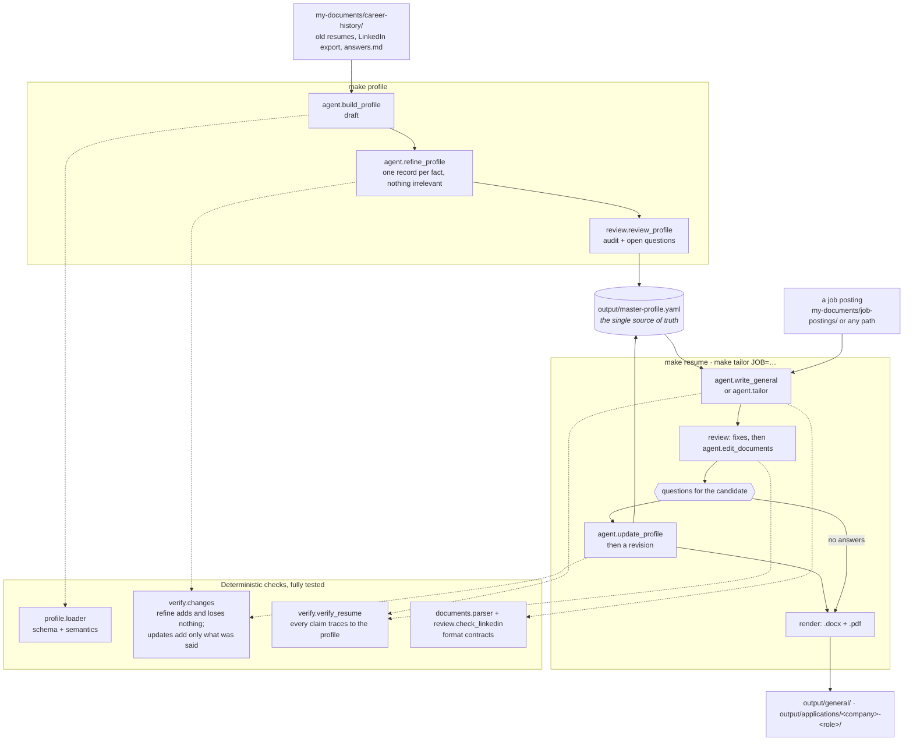

# Architecture

Resume-Tailor has two halves that never mix: **deterministic Python** that you can trust and test,
and a **language model** that writes. Everything the model produces is checked by the
deterministic half before it reaches a file.

## The rule that shapes everything

**The model never writes directly to a file.** Every model operation hands the retry loop in
`agent/loop.py` a check, and a reply is used only once the check passes:

| Operation | Must pass |
|---|---|
| `build_profile` (draft) | the profile loader |
| `refine_profile` | the loader, and `verify.changes.check_refinement`: nothing the draft lacks is added, nothing it has is lost, no level or years raised |
| `update_profile` (answers) | the loader, and `verify.changes.check_update`: every new employer, title, date, credential, technology, link or figure appears in the candidate's own answers |
| `write_general`, `tailor`, `edit_documents` | the format contract of every document, and `verify.verify_resume` on every document: the resume, the cover letter and the LinkedIn profile |

A failure sends the *specific* problems back to the model and retries. After the last attempt it
raises (`FabricationError` for an unsupported claim) rather than writing an unchecked document.
That is why "never fabricates" is a property of the system and not a hope about the prompt.

## The review between a draft and its export

`service/applications.py` runs the same review for both generating scripts: mechanical fixes
(`review.apply_fixes`), an editor pass (`agent.edit_documents`, held to the same checks), then
the questions only the candidate can answer. Answers are logged to
`my-documents/career-history/answers.md` and recorded in the profile by `agent.update_profile`;
the documents are revised against the updated profile, re-verified, and only then exported.
Questions reach the candidate through an `ask` callback, so the same run works at a terminal (the
CLI asks), in a test (a stub answers), or with no one there (the questions come back unasked).

## Why the model sits behind a Protocol

`llm.LanguageModel` is a `Protocol` with one method. Nothing in `agent/` or `service/` imports the
Anthropic SDK, so every test above the boundary drives a fake and stays deterministic, which is how
a package that calls an LLM still holds 100% branch coverage. A second provider is a new file, not
a refactor.

## What runs without an API key

Validating and auditing the profile (`resume-tailor profile validate`), rendering its Markdown view
and schema, and rendering a hand-edited `.md` to `.docx` and `.pdf` (`resume-tailor build`).
Everything that writes (the profile build, the general resume, a tailored application) needs one.
